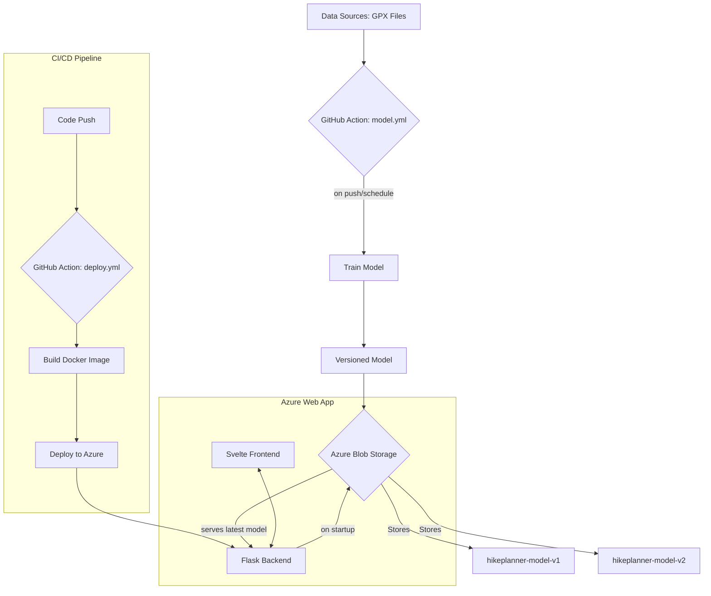

# 🏔️ HikePlanner Pro

HikePlanner ist eine Web-Applikation zur präzisen Vorhersage von Wanderzeiten. Das System kombiniert klassische Wanderformeln mit Machine Learning (Gradient Boosting & Linear Regression), trainiert auf realen GPX-Daten.

Inspired by [mimacom blog](https://blog.mimacom.com/data-collection-scrapy-hiketime-prediction/) and utilizing the [GPX Hike Tracks Dataset](https://www.kaggle.com/datasets/roccoli/gpx-hike-tracks).

**Live Demo:** https://garamer1-f8bnenftc8b7h0a2.norwayeast-01.azurewebsites.net/

---

## 🚀 Key Technical Highlights

Das Projekt umfasst fortgeschrittene Implementierungen im Bereich MLOps und Frontend-Engineering:

### Advanced CI/CD & Cloud Mocking
*   **Pipeline Stability:** Die `ci.yml` führt bei jedem Push automatisierte Tests und Linting (Ruff) aus.
*   **Early-Mocking Strategy:** Um die CI-Pipeline unabhängig von Azure-Credentials zu halten, wurde in `backend/test_app.py` ein **Advanced Mocking** implementiert. Wir fangen Cloud-Abhängigkeiten (Azure Blob Storage API) und Datei-Operationen (`pickle.load`) ab, *bevor* die App instanziiert wird. Dies demonstriert eine saubere Trennung von Infrastruktur und Logik während der Testphase.
*   **Edge-Case Validation:** Die Testsuite validiert die API-Robustheit gegenüber extremen Eingabewerten (negative Höhenmeter, fehlende Parameter).

### Interactive Frontend Experience
*   **Predictive Analytics Visualisierung:** Die Ergebnisse von vier verschiedenen Modellen werden nicht nur als Text, sondern als **dynamische Vergleichsbalken** dargestellt, um die Modell-Unterschiede (Gradient vs. SAC etc.) visuell greifbar zu machen.
*   **API Performance & Debouncing:** Ein 300ms Debouncing-Mechanismus für die Slider verhindert redundante API-Calls und optimiert die Serverlast.
*   **Modern UX:** Nutzung von Svelte-Transitions, Loading-Spinnern und einem modernen Glassmorphism-Design für eine flüssige User-Experience.

---

## 🏗️ ModelOps Pipeline

Dieses Projekt implementiert einen vollautomatisierten ModelOps-Lifecycle. Die Pipeline stellt sicher, dass das Modell kontinuierlich trainiert wird und die Web-App immer die beste verfügbare Version bereitstellt.



---

## ☁️ Azure Blob Storage Integration

*   **Modell-Management:** Die `model.yml` automatisiert das Training und den Upload neuer Modellversionen.
*   **Dynamisches Laden:** Das Backend identifiziert beim Start automatisch die neueste Version (`hikeplanner-model-X`) im Blob Storage und lädt diese zur Laufzeit.

---

## 🛠️ GitHub Actions

*   **`ci.yml`**: Linting (Ruff) und Integration-Tests mit Cloud-Mocking.
*   **`deploy.yml`**: Automatisierter Build und Deployment des Docker-Containers auf Azure App Services.
*   **`model.yml`**: End-to-End Training-Pipeline für die ML-Modelle.

---

## 🚀 Installation & Setup

1.  **Backend:**
    ```bash
    pyenv local 3.13.7
    uv venv .venv
    uv sync
    ```
2.  **Frontend:**
    ```bash
    cd frontend
    npm install
    npm run build
    ```
3.  **Docker (Lokal):**
    ```bash
    docker build -t hikeplanner .
    docker run -p 80:80 -e AZURE_STORAGE_CONNECTION_STRING='your_key' hikeplanner
    ```
