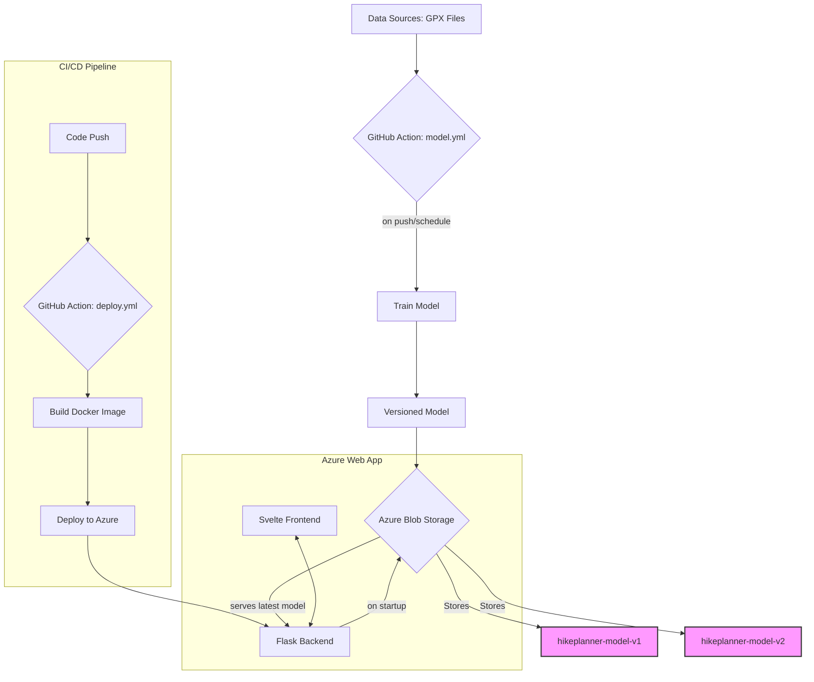

# HikePlanner

inspired by https://blog.mimacom.com/data-collection-scrapy-hiketime-prediction/
similar dataset 

## Data

* https://www.kaggle.com/datasets/roccoli/gpx-hike-tracks

## ModelOps Pipeline

This project implements a full, automated ModelOps lifecycle. The pipeline ensures that the model is continuously trained with the latest data and the web application is always serving the best available model version.

## Azure Blob Storage

* **Save model to Azure Blob Storage**: The `model.yml` workflow automatically trains and pushes new, versioned models.
* **Always save new version of model**: The backend dynamically loads the latest version by checking the highest version number (`hikeplanner-model-X`).
* **Access**: Provided via GitHub Secrets (`AZURE_STORAGE_CONNECTION_STRING`) for Actions and as an environment variable in the Azure Web App.

## GitHub Action

* **model.yml**: Handles model training and publishing to Azure Blob Storage.
* **deploy.yml**: Builds the production Docker image and deploys it to the Azure Web App.
* **ci.yml**: Runs linters and tests on every push to ensure code quality.

## App
* **Backend**: Python Flask (`backend/app.py`) serving the model predictions.
* **Frontend**: SvelteKit (`frontend/`) providing the user interface.

## Deployment with Docker

* **Dockerfile**: Defines the container environment. The frontend is currently pre-built and copied.
* **Dependencies**: Managed via `uv`.
* **Cloud Integration**: The app connects to Azure Blob Storage on startup to download the latest ML model.

## Installation

* `pyenv local 3.13.7`
* `uv venv .venv`
* `uv sync`

## Ideas

* **Personalized Model**: Fine-tune the model for a specific user's hiking data.
* **Multi-Stage Dockerfile**: Integrate the frontend build process directly into the Docker build.
* **Monitoring**: Add logging for model predictions to detect potential model drift over time.
